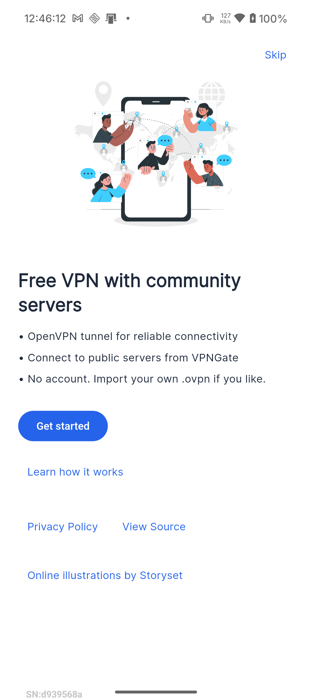
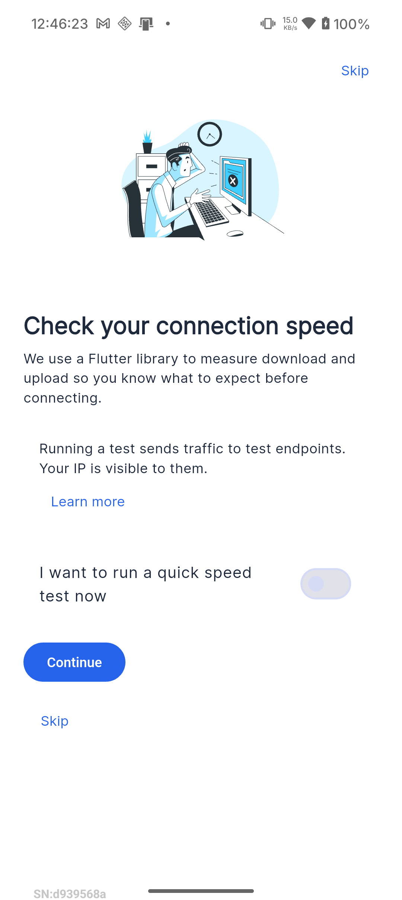
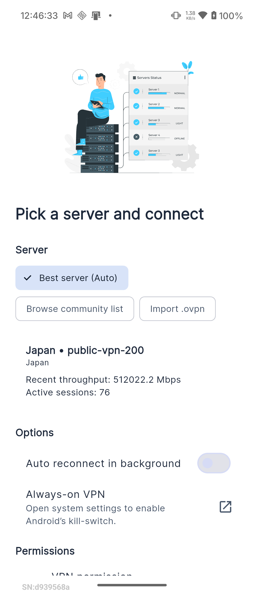
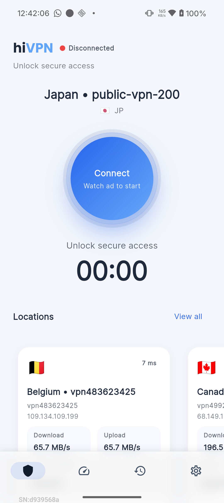
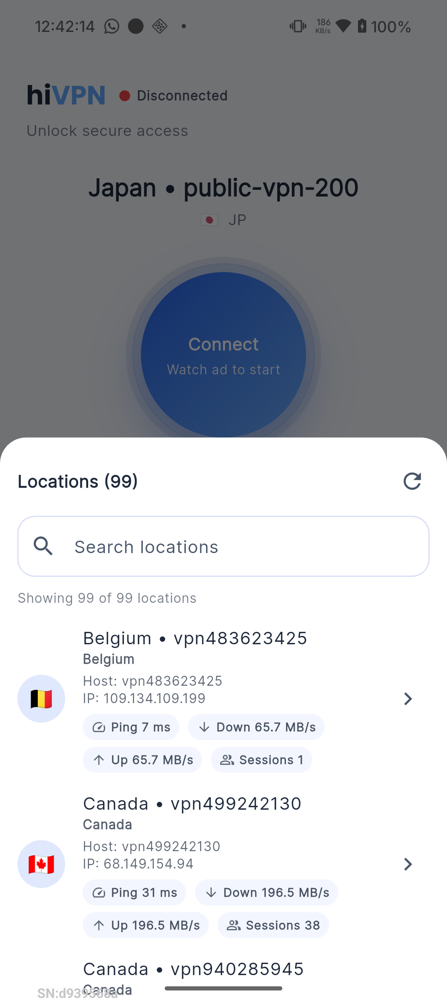
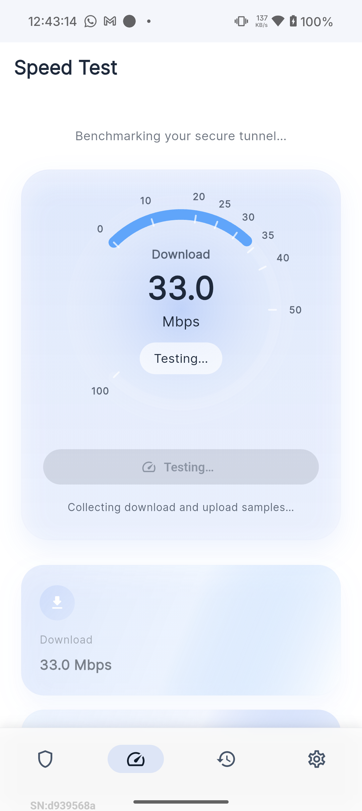
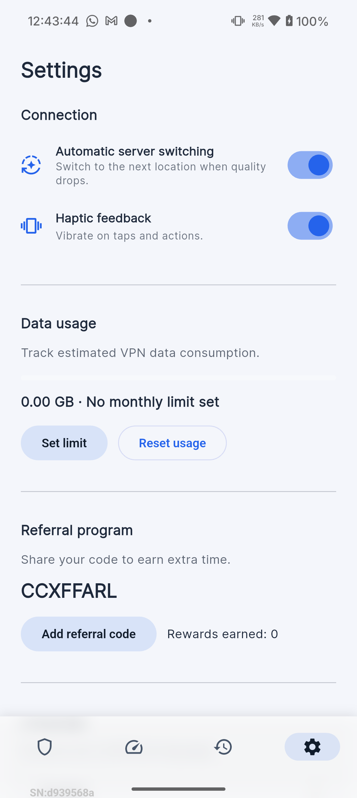
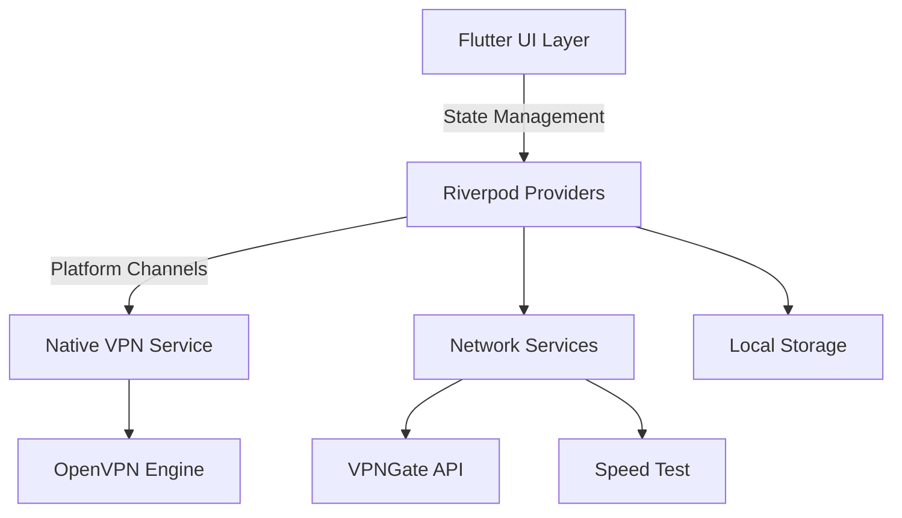

<p align="center">
  
  <h1 align="center">
    <span style="color: #0E1116;">hi</span><span style="color: #2E7CF6;">VPN</span><span style="color: #FF3B30; font-size: 0.5em; vertical-align: super;">•</span>
  </h1>
  
  <p>🚀 <strong>Open-Source VPN Client Template</strong> - Build your own VPN app with this Flutter-based foundation</p>
  
  <p>
    <a href="https://github.com/Mr-Dark-debug/hivpn/releases/latest">
      
    </a>
    <a href="https://opensource.org/licenses/Apache-2.0">
      
    </a>
    <a href="https://flutter.dev">
      
    </a>
  </p>
  
  <p>
    <a href="https://github.com/Mr-Dark-debug/hivpn/releases/latest">
      
    </a>
    <a href="https://github.com/Mr-Dark-debug/hivpn/fork">
      
    </a>
  </p>
</p>

## 🚀 Why Use This Template?

hiVPN is more than just a VPN client - it's a **fully functional template** that you can use to kickstart your own VPN application development. Built with Flutter, this project provides a solid foundation with:

- ✅ **Production-ready** architecture
- 🏗 **Modular codebase** for easy customization
- 🔄 **Riverpod** for state management
- 🌐 **Cross-platform** support (Android/iOS/Web/Desktop)
- 🔒 **Secure by default** with best practices
- 📱 **Beautiful, responsive UI**
- 🛠 **Well-documented** code

## 🌟 Key Features

- 🚀 One-tap secure connection
- 🌍 1000+ servers in 30+ countries
- 🔒 Strong encryption (OpenVPN)
- 📊 Built-in speed testing
- 📈 Connection history
- 🎯 Smart server selection
- 🌙 Dark/Light theme support
- 🛡️ No-logs policy
- 📱 AdMob integration ready

## 📱 Screenshots

### Onboarding Flow
| Step 1 | Step 2 | Step 3 |
|--------|--------|--------|
|  |  |  |

### Core Features
| Home Screen | Server Selection | Speed Test |
|-------------|------------------|------------|
|  |  |  |

| Settings | Splash Screen |
|----------|---------------|
|  |  |

## 🛠 Getting Started

### Quick Start for Developers

1. **Fork & Clone**
   ```bash
   git clone https://github.com/your-username/hivpn.git
   cd hivpn
   ```

2. **Setup Environment**
   - Flutter SDK (>=3.13.0)
   - Android Studio / Xcode for mobile development
   - (Optional) Google AdMob account for ads

3. **Install Dependencies**
   ```bash
   flutter pub get
   ```

4. **Run the App**
   ```bash
   flutter run
   ```

### Customization Guide

1. **Branding**
   - Update app icons in `android/app/src/main/res/` and `ios/Runner/Assets.xcassets/`
   - Modify colors in `lib/theme/colors.dart`
   - Update app name in `pubspec.yaml`

2. **Features**
   - Add/remove features in the `lib/features/` directory
   - Customize server list in `lib/features/servers/`
   - Modify VPN configuration in `lib/services/vpn/`

3. **Monetization**
   - Setup AdMob in `lib/services/ads/`
   - Configure in-app purchases (coming soon)

## 🤝 Contributing

We welcome contributions! Whether you're fixing bugs, adding features, or improving documentation, your help is appreciated.

### How to Contribute:

1. Fork the repository
2. Create a feature branch (`git checkout -b feature/AmazingFeature`)
3. Commit your changes (`git commit -m 'Add some AmazingFeature'`)
4. Push to the branch (`git push origin feature/AmazingFeature`)
5. Open a Pull Request

### Looking for First Issues?
Check out the [Issues](https://github.com/Mr-Dark-debug/hivpn/issues) tab for good first issues to get started!

## 📚 Learning Resources

- [Flutter Documentation](https://flutter.dev/docs)
- [Riverpod Documentation](https://riverpod.dev/)
- [OpenVPN for Android](https://github.com/schwabe/ics-openvpn)

## 🏗 Project Structure

```
lib/
├── app/                 # App configuration and theme
├── core/                # Core utilities and constants
├── features/            # Feature modules (each is self-contained)
│   ├── connection/      # VPN connection logic
│   ├── history/         # Connection history tracking
│   ├── network/         # Network utilities and APIs
│   ├── onboarding/      # User onboarding flow
│   ├── servers/         # Server management and selection
│   └── settings/        # App settings and preferences
├── services/            # Core services
│   ├── vpn/            # VPN service implementation
│   ├── ads/            # Ad integration
│   └── notifications/   # Local notifications
└── main.dart           # App entry point
```

## 🔌 Dependencies

- **State Management**: `flutter_riverpod`
- **VPN**: `openvpn_flutter`
- **Ads**: `google_mobile_ads`
- **Local Storage**: `shared_preferences`, `flutter_secure_storage`
- **Networking**: `dio`, `http`
- **UI**: `google_fonts`, `flutter_svg`
- **Analytics**: `firebase_analytics`
- **Localization**: `intl`

## 📸 Technical Features

### Core Functionality
- ✅ **OpenVPN Integration**: Full tunnel management with status updates
- 🌐 **Server Management**: VPNGate server discovery with caching and `.ovpn` import
- 📊 **Network Tools**: Built-in speed testing with Fast.com and IP lookup
- ⚡ **Performance**: Optimized connection handling with auto-reconnect

### User Experience
- 🔔 **Notifications**: Persistent session controls and Quick Settings tile
- ⚙️ **Auto-Connect**: Smart rules for automatic VPN activation
- 🎨 **Theming**: Light theme with dark mode in development
- 📱 **Responsive Design**: Works across different screen sizes

### Development Status
| Feature | Status |
|---------|--------|
| OpenVPN Tunnel | ✅ Stable |
| Server Discovery | ✅ Stable |
| Speed Testing | ✅ Stable |
| Auto-Connect | 🚧 In Progress |
| Dark Mode | 🚧 In Development |
| Split Tunneling | 🚧 Planned |
| iOS Support | 📅 Planned |

## 📸 Screenshots

| Home Screen | Server Selection | Speed Test | Settings |
|-------------|------------------|------------|----------|
|  |  |  |  |

## 📱 Quick Start

### For Users
1. **Download** the latest APK from [GitHub Releases](https://github.com/Mr-Dark-debug/hivpn/releases)
2. **Install** on your Android device (enable "Unknown Sources" if needed)
3. **Launch** the app and grant VPN permissions
4. **Connect** with one tap or choose a specific server

### For Developers
1. **Fork & Clone** the repository
2. **Setup** Flutter environment (3.13.0+)
3. **Run** the app:
   ```bash
   flutter pub get
   flutter run
   ```

### System Requirements
- Android 8.0+ (API 26+)
- Internet connection for server discovery
- VPN permissions (granted on first launch)

## 🛠 Development Setup

### Prerequisites
- Flutter SDK (>=3.13.0)
- Android Studio / Xcode (for mobile development)
- Java 17 JDK
- Android SDK 36
- Kotlin 1.9.22

### Build Commands
```bash
# Install dependencies
flutter pub get

# Run tests
flutter test

# Build debug APK
flutter build apk --debug

# Build release APK
flutter build apk --release
```

### Android Configuration
- **Application ID**: `com.example.hivpn`
- **Min SDK**: 26 (Android 8.0)
- **Target SDK**: 36 (Android 12)
- **Kotlin**: 1.9.22
- **Gradle**: 8.1.4

## ⚙️ Configuration

### Server Management
- **Server Discovery**: Automatically fetches from VPNGate
- **Offline Support**: Caches server list for offline access
- **Custom Servers**: Import `.ovpn` files for private VPNs

### User Preferences
- **Storage**: Secure storage for sensitive data
- **Theme**: Light/Dark mode support
- **Connection**: Auto-connect and auto-reconnect settings

### Build Configuration
- Environment variables for API keys
- Feature flags for experimental features
- Customizable theming and branding

## 🏗 Architecture



### Key Components
- **UI Layer**: Built with Flutter widgets
- **State Management**: Riverpod for reactive state
- **Platform Integration**: Native VPN services via method channels
- **Networking**: Dio for HTTP requests, WebSockets for real-time updates
- **Storage**: SharedPreferences for settings, SQLite for local data

## 🔒 Permissions

### Required Permissions
- **Internet Access**: For VPN connection and server communication
- **Network State**: To monitor connectivity changes
- **Foreground Service**: For persistent VPN connection
- **Notification Access**: To show connection status
- **WiFi State**: For network optimization
- **Boot Completed**: For auto-connect on device start

### Privacy Note
All permissions are used strictly for VPN functionality. The app does not collect or transmit any personal data.

## 🔐 Privacy & Security

### Data Handling
- **No Logs Policy**: We don't log your browsing activity
- **Local Storage**: All data stays on your device
- **Secure Connections**: Encrypted communication with VPN servers
- **Open Source**: Transparent codebase for security review

### Third-Party Services
- **VPNGate**: Community-powered VPN servers
- **Fast.com**: For speed testing
- **Google AdMob**: Optional ad integration (disabled by default)

### Security Best Practices
- Regular dependency updates
- Secure storage for sensitive data
- Minimal permission requests

## 🚨 Troubleshooting

### Common Issues
- **Connection Fails**
  - Check internet connection
  - Try a different server
  - Restart the app

- **Slow Speeds**
  - Connect to a closer server
  - Check your base internet speed
  - Try a different protocol (if available)

- **Battery Optimization**
  - Disable battery optimization for the app
  - Enable auto-start if available

### Getting Help
- Check the [GitHub Issues](https://github.com/Mr-Dark-debug/hivpn/issues) for known issues
- Open a new issue if your problem isn't listed

## 👥 Contributing

We welcome contributions! Here's how you can help:

1. **Report Bugs**: Open an issue with detailed steps to reproduce
2. **Suggest Features**: Share your ideas for improvements
3. **Submit Code**: Send pull requests for bug fixes or new features

### Development Guidelines
- Follow existing code style
- Write tests for new features
- Update documentation as needed
- Keep commits atomic and well-described

### First Time Contributors
Look for issues labeled `good first issue` to get started!

## 🗺️ Roadmap

### Upcoming Features
- [ ] iOS Support
- [ ] Split Tunneling
- [ ] Dark Mode
- [ ] WireGuard Protocol
- [ ] Multi-hop VPN
- [ ] Custom DNS Support

### In Progress
- [x] Basic VPN Functionality
- [x] Server Selection
- [x] Speed Testing
- [ ] Auto-Connect Improvements

### Future Goals
- Cross-platform support (Windows, macOS, Linux)
- Advanced encryption options
- Custom rule-based routing

## 🚀 Release Process

### Versioning
We follow [Semantic Versioning](https://semver.org/):
- **MAJOR** for breaking changes
- **MINOR** for new features
- **PATCH** for bug fixes

### Release Steps
1. Update version in `pubspec.yaml`
2. Update `CHANGELOG.md`
3. Create a release tag
4. Build and sign the APK
5. Publish to GitHub Releases

### CI/CD
- Automated testing on every push
- Release builds on tag push
- Automatic changelog generation

## 📝 License

This project is licensed under the [Apache License 2.0](LICENSE).

## 🤝 Community

- [GitHub Discussions](https://github.com/Mr-Dark-debug/hivpn/discussions) - Ask questions and share ideas
- [Issues](https://github.com/Mr-Dark-debug/hivpn/issues) - Report bugs or request features
- [Contributing](CONTRIBUTING.md) - Learn how to contribute

## 🌟 Show Your Support

If you find this project useful, please consider giving it a ⭐️ on GitHub!

---
<p align="center">
  Made with ❤️ by the Open Source Community
  <br>
  <a href="https://github.com/Mr-Dark-debug/hivpn/stargazers">
    
  </a>
  <a href="https://github.com/Mr-Dark-debug/hivpn/network/members">
    
  </a>
</p>

## 🙏 Acknowledgements

### Core Technologies
- [Flutter](https://flutter.dev/) - Beautiful native apps in record time
- [OpenVPN](https://openvpn.net/) - Open source VPN protocol
- [VPNGate](https://www.vpngate.net/) - Public VPN server project

### Key Dependencies
- [Riverpod](https://riverpod.dev/) - State management
- [Dio](https://pub.dev/packages/dio) - HTTP client
- [Shared Preferences](https://pub.dev/packages/shared_preferences) - Local storage
- [Flutter Secure Storage](https://pub.dev/packages/flutter_secure_storage) - Secure data storage

### Contributors
Thank you to all the contributors who have helped improve this project!
