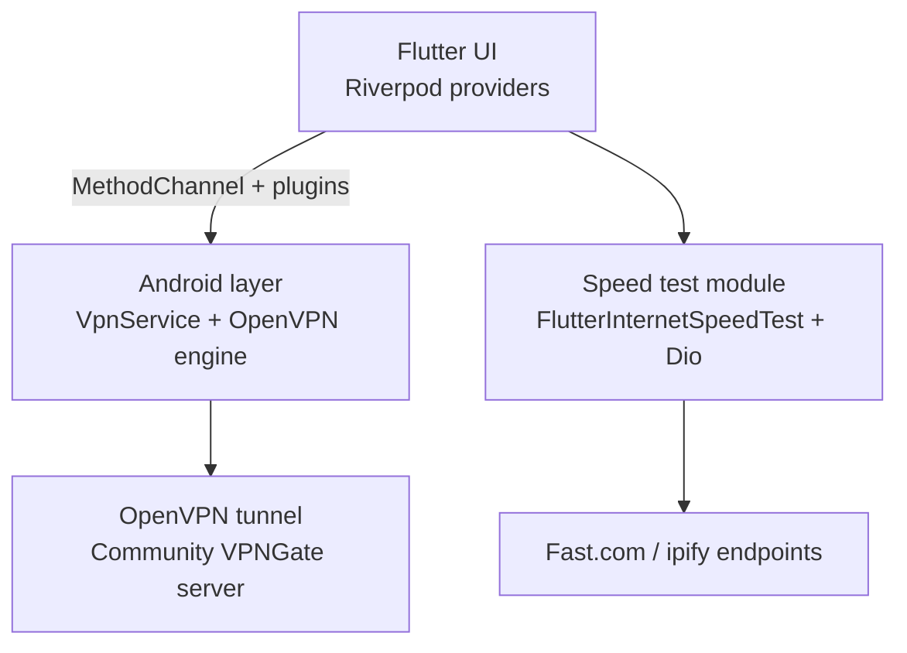

# README.md
<div class="hivpn-logo-wrapper" aria-label="hiVPN wordmark">
  <div class="hivpn-logo">
    <span class="hi">hi</span><span class="vpn">VPN</span><span class="dot" aria-hidden="true">•</span>
  </div>
</div>
<style>
.hivpn-logo-wrapper {
  width: 100%;
  display: flex;
  justify-content: center;
  margin: 1.5rem 0 0.5rem;
}
.hivpn-logo {
  --hi-color: #0E1116;
  --vpn-color: #2E7CF6;
  --dot-color: #FF3B30;
  font-family: Inter, -apple-system, Segoe UI, Roboto, system-ui, sans-serif;
  font-weight: 700;
  font-size: clamp(2.4rem, 6vw, 3.4rem);
  letter-spacing: 0.06em;
  display: inline-flex;
  align-items: center;
  text-align: left;
  color: var(--hi-color);
}
.hivpn-logo .hi {
  color: var(--hi-color);
}
.hivpn-logo .vpn {
  color: var(--vpn-color);
  margin-left: 0.1em;
}
.hivpn-logo .dot {
  color: var(--dot-color);
  font-size: 0.35em;
  margin-left: 0.3em;
  align-self: flex-start;
  position: relative;
  top: 0.1em;
}
@media (prefers-reduced-motion: no-preference) {
  .hivpn-logo {
    animation: hivpn-reveal 1.2s ease both;
  }
  @keyframes hivpn-reveal {
    from {
      letter-spacing: 0.3em;
      opacity: 0;
    }
    to {
      letter-spacing: 0.06em;
      opacity: 1;
    }
  }
}
.download-button-wrap {
  display: flex;
  justify-content: center;
  margin: 0.75rem 0 1.5rem;
}
.download-button {
  font-family: Inter, -apple-system, Segoe UI, Roboto, system-ui, sans-serif;
  font-weight: 600;
  background: linear-gradient(90deg, #2E7CF6, #174CBA);
  color: #fff;
  padding: 0.85rem 1.8rem;
  border-radius: 999px;
  text-decoration: none;
  box-shadow: 0 8px 20px rgba(46, 124, 246, 0.25);
  transition: transform 0.2s ease, box-shadow 0.2s ease;
}
.download-button:focus,
.download-button:hover {
  transform: translateY(-2px);
  box-shadow: 0 12px 28px rgba(46, 124, 246, 0.35);
}
</style>

Secure, community-powered VPN for Android today, with iOS support on the roadmap.

<div class="download-button-wrap">
  <a class="download-button" href="https://github.com/OWNER/hivpn/releases" rel="noopener" target="_blank">Download Android APK on GitHub</a>
</div>

## 1. Overview
hiVPN is an Android-first Flutter client that drives OpenVPN via the `openvpn_flutter` engine, discovers volunteer VPNGate servers, and offers built-in network diagnostics with `flutter_speed_test_plus`, all coordinated through Riverpod providers. <!-- evidence: lib/services/vpn/openvpn_port.dart:1-170 --> <!-- evidence: lib/features/servers/data/server_repository.dart:1-190 --> <!-- evidence: lib/services/speedtest/speedtest_service.dart:1-120 --> <!-- evidence: pubspec.yaml:1-60 -->

- **What this is:** an open-source reference app showing how to ship an Android VPN that respects modern platform requirements (VpnService, foreground + notifications) while leaning on community servers.
- **What this is not:** a zero-trust or audited security solution; commercial uptime, privacy guarantees, and enterprise tunneling policies are out of scope.


*iOS build targets are planned but not yet available; today the shipped binary supports Android devices only.*

## 2. Badges
     

## 3. Table of Contents
- [Overview](#1-overview)
- [Badges](#2-badges)
- [Features](#4-features)
- [Screenshots](#5-screenshots)
- [Quick Start (Users)](#6-quick-start-users)
- [Build From Source](#7-build-from-source)
- [Configuration](#8-configuration)
- [Architecture](#9-architecture)
- [Permissions](#10-permissions)
- [Privacy & Security](#11-privacy--security)
- [Troubleshooting](#12-troubleshooting)
- [Contributing](#13-contributing)
- [Roadmap](#14-roadmap)
- [Release process](#15-release-process)
- [License](#16-license)
- [Acknowledgements](#17-acknowledgements)

## 4. Features
- ✅ OpenVPN tunnel management with staged status updates through `openvpn_flutter`. <!-- evidence: lib/services/vpn/openvpn_port.dart:1-200 -->
- ✅ VPNGate server discovery, caching, and `.ovpn` import with validation for host/port/cipher. <!-- evidence: lib/features/servers/data/server_repository.dart:1-200 --> <!-- evidence: lib/features/onboarding/presentation/onboarding_flow.dart:500-620 -->
- ✅ Built-in speed test using `flutter_speed_test_plus`, Fast.com defaults, and ipify IP lookups. <!-- evidence: lib/services/speedtest/speedtest_service.dart:1-120 --> <!-- evidence: lib/features/speedtest/data/speedtest_repository.dart:1-80 -->
- ⚙️ Auto-connect rules (on launch/on network change) with Riverpod-backed settings. <!-- evidence: lib/features/settings/domain/auto_connect_rules.dart:1-120 --> <!-- evidence: lib/features/session/domain/session_controller.dart:500-620 -->
- ✅ Foreground session notifications with disconnect/extend actions plus Quick Settings tile refresh. <!-- evidence: lib/services/notifications/session_notification_service.dart:1-200 --> <!-- evidence: android/app/src/main/kotlin/com/example/hivpn/vpn/HiVpnTileService.kt:1-80 -->
- ✅ Shortcut to Android’s Always-on VPN settings from onboarding. <!-- evidence: lib/features/onboarding/presentation/onboarding_flow.dart:500-540 -->
- 🚧 Split tunnel selections persisted but not yet enforced by the OpenVPN layer. <!-- evidence: lib/features/settings/domain/split_tunnel_config.dart:1-120 -->
- 🚧 Dark mode theming still to come (current palette is light-only). <!-- evidence: lib/theme/theme.dart:1-160 -->

### What’s working / What’s not (yet)

| Working today | Not yet / planned |
| --- | --- |
| OpenVPN tunnel lifecycle, notification actions, connection timeout handling. <!-- evidence: lib/features/session/domain/session_controller.dart:1-200 --> | Auto-reconnect on boot/network change receivers are placeholders that currently log only. <!-- evidence: android/app/src/main/kotlin/com/example/hivpn/vpn/AutoConnectReceivers.kt:1-120 --> |
| VPNGate catalogue fetch with SharedPreferences cache fallback. <!-- evidence: lib/features/servers/data/server_repository.dart:1-150 --> | Enforcing split tunnel packages inside the OpenVPN engine. |
| Speed test telemetry stored locally for quick resume. <!-- evidence: lib/features/speedtest/domain/speedtest_controller.dart:1-320 --> | Continuous integration / automated release pipeline. |
| Connection history and data usage tracking persisted in SharedPreferences. <!-- evidence: lib/features/history/data/connection_history_repository.dart:1-80 --> | Dark mode, tablet layout polishing. |

## 5. Screenshots
| Home | Server list |
| --- | --- |
|  <br/>Dashboard & session controls |  <br/>VPNGate catalogue with filters |

| Speed test | Settings |
| --- | --- |
|  <br/>Live bandwidth graph |  <br/>Auto-connect & personalization |

<!-- Maintainers: keep screenshots ≤1600px wide and provide @2x variants where appropriate. -->

| # | Path | Description |
| - | - | - |
| 1 | `docs/images/home.png` | Main session dashboard |
| 2 | `docs/images/server-list.png` | VPNGate server browser |
| 3 | `docs/images/speedtest.png` | Speed test results view |
| 4 | `docs/images/settings.png` | Settings and personalization |

## 6. Quick Start (Users)
### Download
- Grab the latest Android APK from [GitHub Releases](https://github.com/OWNER/hivpn/releases); no Play Store listing is available yet.
- iOS builds are planned but not yet published.

### Install on Android
1. Transfer the APK to your device.
2. Enable *Install unknown apps* for your file manager/browser.
3. Open the APK and follow the prompts.

### First run
- Accept the Android VPN permission prompt triggered by the `VpnService.prepare` flow. <!-- evidence: android/app/src/main/kotlin/com/example/hivpn/MainActivity.kt:1-120 -->
- Optionally grant notification access so ongoing session status can be shown. <!-- evidence: android/app/src/main/AndroidManifest.xml:1-80 --> <!-- evidence: lib/services/notifications/session_notification_service.dart:1-200 -->

### Connect
- **Auto server:** Use the quick connect button; the app uses the last selected VPNGate entry.
- **Browse VPNGate:** Open the server picker, filter by country or latency, then connect. <!-- evidence: lib/features/servers/data/server_repository.dart:1-200 -->
- **Import `.ovpn`:** From onboarding or settings, choose “Import .ovpn,” pick a file, and the app validates host/port directives before adding it. <!-- evidence: lib/features/onboarding/presentation/onboarding_flow.dart:540-620 -->

### Speed test
- Run the in-app test to measure download/upload (Fast.com defaults) and fetch your public IP via ipify; remember the test endpoint will see your real IP at that moment. <!-- evidence: lib/features/speedtest/data/speedtest_repository.dart:1-80 --> <!-- evidence: lib/services/speedtest/speedtest_service.dart:1-120 -->

### Known limitations
- VPNGate servers are volunteer-operated; speed and availability vary widely.
- Auto-reconnect on boot/network change is not yet wired through to the tunnel engine.
- Dark theme and tablet UX are in progress.
- iOS support is under development.

## 7. Build From Source
### Prerequisites
- Flutter stable channel (SDK constraint `>=3.3.0 <4.0.0`). <!-- evidence: pubspec.yaml:1-20 -->
- Android Studio or CLI tools with compile SDK 36, minSdk 26, targetSdk 36, and NDK 27.0.12077973. <!-- evidence: android/app/build.gradle.kts:1-80 -->
- Java 17 toolchain (`sourceCompatibility`/`targetCompatibility` & Kotlin JVM target). <!-- evidence: android/app/build.gradle.kts:8-40 -->
- Kotlin 1.9.22 and Android Gradle Plugin 8.1.4. <!-- evidence: android/build.gradle.kts:1-80 -->
- Gradle wrapper 8.10.2 (managed via the repo). <!-- evidence: android/gradle/wrapper/gradle-wrapper.properties:1-10 -->

### Commands
```bash
flutter --version         # confirm toolchain
flutter pub get
flutter test
flutter build apk --debug
flutter build apk --release
```

### Android identifiers
- Application ID: `com.example.hivpn`. <!-- evidence: android/app/build.gradle.kts:8-40 -->
- Min SDK: 26; Target SDK: 36; Compile SDK: 36. <!-- evidence: android/app/build.gradle.kts:8-40 -->
- Foreground service + special-use permissions declared for long-lived VPN sessions. <!-- evidence: android/app/src/main/AndroidManifest.xml:1-80 -->

No extra Gradle properties or environment variables are required beyond the defaults in `android/gradle.properties`. <!-- evidence: android/gradle.properties:1-40 -->

## 8. Configuration
- **Server catalogue:** Pulled from multiple VPNGate endpoints, decoded from CSV, and cached in `SharedPreferences` for offline fallback. <!-- evidence: lib/features/servers/data/server_repository.dart:1-200 -->
- **User preferences:** Stored via a Riverpod-backed `PrefsStore` wrapper around `SharedPreferences`. <!-- evidence: lib/services/storage/prefs.dart:1-80 -->
- **Secure secrets:** Anything sensitive can be persisted through `SecureStore` (`flutter_secure_storage`). <!-- evidence: lib/services/storage/secure_store.dart:1-40 -->
- **Speed test:** Config defaults (Fast.com & ipify) plus last results persisted in preferences for quick rehydration. <!-- evidence: lib/features/speedtest/domain/speedtest_controller.dart:1-320 -->
- **`.ovpn` import:** File picker enforces extension, validates `remote` directive, and stores sanitized config for later use. <!-- evidence: lib/features/onboarding/presentation/onboarding_flow.dart:540-620 -->
- **Auto-connect:** `AutoConnectRules` toggles (launch, boot, network change) saved for future tunnel automation. <!-- evidence: lib/features/settings/domain/auto_connect_rules.dart:1-120 -->
- **Build-time flags:** None at present; consider `--dart-define` for future secrets/toggles.

## 9. Architecture


- `lib/features/*` contains feature slices (servers, session, speedtest, onboarding).
- `lib/services/*` houses platform abstractions (VPN port, notifications, storage).
- `lib/platform/android` bridges method channel intents such as Quick Settings tile updates. <!-- evidence: lib/platform/android/extend_intent_handler.dart:1-120 -->
- `android/app/src/main/kotlin` covers `MainActivity` and receivers/services required for Android integration. <!-- evidence: android/app/src/main/kotlin/com/example/hivpn/MainActivity.kt:1-160 --> <!-- evidence: android/app/src/main/kotlin/com/example/hivpn/vpn/HiVpnTileService.kt:1-80 -->

## 10. Permissions
- `android.permission.ACCESS_NETWORK_STATE` — detect connectivity before/after tunnels. <!-- evidence: android/app/src/main/AndroidManifest.xml:1-20 -->
- `android.permission.INTERNET` — tunnel establishment and API calls. <!-- evidence: android/app/src/main/AndroidManifest.xml:1-20 -->
- `android.permission.FOREGROUND_SERVICE` & `FOREGROUND_SERVICE_SPECIAL_USE` — comply with Android 14+ VPN foreground requirements. <!-- evidence: android/app/src/main/AndroidManifest.xml:1-20 -->
- `android.permission.ACCESS_WIFI_STATE` / `CHANGE_NETWORK_STATE` — server recommendations and potential split-tunnel prep. <!-- evidence: android/app/src/main/AndroidManifest.xml:1-20 -->
- `android.permission.POST_NOTIFICATIONS` — show session state + action buttons. <!-- evidence: android/app/src/main/AndroidManifest.xml:1-40 --> <!-- evidence: lib/services/notifications/session_notification_service.dart:1-200 -->
- `android.permission.RECEIVE_BOOT_COMPLETED` — placeholder receiver for future auto-reconnect. <!-- evidence: android/app/src/main/AndroidManifest.xml:1-80 --> <!-- evidence: android/app/src/main/kotlin/com/example/hivpn/vpn/AutoConnectReceivers.kt:1-120 -->
- `android.permission.BIND_QUICK_SETTINGS_TILE` — Quick Settings tile integration. <!-- evidence: android/app/src/main/AndroidManifest.xml:40-80 -->

## 11. Privacy & Security
- **Local storage:** Connection history, speed test results, and settings are persisted in `SharedPreferences`; secure values can flow through `SecureStore`. <!-- evidence: lib/features/history/data/connection_history_repository.dart:1-80 --> <!-- evidence: lib/services/storage/prefs.dart:1-80 --> <!-- evidence: lib/services/storage/secure_store.dart:1-40 -->
- **In-flight data:** OpenVPN configs (username/password `vpn`) are used to connect to VPNGate nodes; traffic is relayed through whichever volunteer server you pick. <!-- evidence: lib/services/vpn/openvpn_port.dart:1-200 -->
- **VPNGate disclosure:** Servers are community-run, so operators may log metadata; use only if you trust the endpoint. <!-- evidence: lib/features/servers/data/vpngate_api.dart:1-160 -->
- **Speed test telemetry:** Downloads/uploads run against Fast.com endpoints and IP lookups call api64.ipify.org. <!-- evidence: lib/features/speedtest/data/speedtest_repository.dart:1-80 -->
- **Analytics/telemetry:** No third-party analytics; the `AnalyticsService` only logs to console in debug builds. <!-- evidence: lib/services/analytics/analytics_service.dart:1-60 -->
- **Ads:** A Google AdMob test ID is bundled for extension prompts; swap with your own before production. <!-- evidence: android/app/src/main/AndroidManifest.xml:20-80 -->

## 12. Troubleshooting
- **VPN permission denied:** Re-launch; Android will re-prompt `VpnService.prepare`. Settings → Network & Internet → VPN to grant manually. <!-- evidence: android/app/src/main/kotlin/com/example/hivpn/MainActivity.kt:1-160 -->
- **Connect loop or timeouts:** Try another VPNGate node; connection attempts auto-cancel after 45 seconds. <!-- evidence: lib/features/session/domain/session_controller.dart:1-120 -->
- **Background session stopped:** Ensure notifications are enabled and battery optimizations are relaxed for hiVPN.
- **Speed test stuck:** Network filters/firewalls can block Fast.com; rerun later or disable split tunnel (if enabled). <!-- evidence: lib/features/speedtest/domain/speedtest_controller.dart:1-240 -->
- **Quick Settings tile stale:** Open the app to trigger `updateQuickTile`. <!-- evidence: android/app/src/main/kotlin/com/example/hivpn/MainActivity.kt:1-120 -->

## 13. Contributing
1. Fork and clone the repository.
2. Create a feature branch using Conventional Commit prefixes (e.g., `feat/`, `fix/`).
3. Run `flutter pub get`, `flutter analyze`, and `flutter test` before submitting.
4. Format Dart with `flutter format .` and Kotlin/Gradle via Android Studio or `ktlint` (optional).
5. Open a pull request describing your change and include screenshots if UI is affected.

Use Riverpod providers for state, keep business logic inside `lib/features/*` slices, and follow the Material 3 design tokens in `lib/theme`. <!-- evidence: lib/app/app.dart:1-80 --> <!-- evidence: lib/theme/theme.dart:1-160 -->

## 14. Roadmap
- [ ] Wire auto-reconnect receivers into the VPN port for boot/network recovery. <!-- evidence: android/app/src/main/kotlin/com/example/hivpn/vpn/AutoConnectReceivers.kt:1-120 -->
- [ ] Enforce split tunnel selections within OpenVPN config generation. <!-- evidence: lib/features/settings/domain/split_tunnel_config.dart:1-120 -->
- [ ] Add dark theme variants and dynamic color support. <!-- evidence: lib/theme/theme.dart:1-160 -->
- [ ] Stand up CI (GitHub Actions) for analysis, tests, and release artifacts.
- [ ] Replace AdMob test ID with production credentials and privacy strings.
- [ ] Publish iOS build alongside Android APKs.

## 15. Release process
1. Bump `version` in `pubspec.yaml`.
2. Update changelog (TODO).
3. Run the build commands above for release APK/AAB.
4. Sign artifacts (replace debug signingConfig) and upload to GitHub Releases (APK distribution) / Play Console when ready.
5. TODO: Automate via CI once workflows are added.

## 16. License
**TODO:** Choose and add an open-source license for this project.

## 17. Acknowledgements
- [VPNGate Project](https://www.vpngate.net/) for the public VPN catalogue.
- [`openvpn_flutter`](https://pub.dev/packages/openvpn_flutter) for embedding the OpenVPN engine. <!-- evidence: lib/services/vpn/openvpn_port.dart:1-200 -->
- [`flutter_speed_test_plus`](https://pub.dev/packages/flutter_speed_test_plus) for easy network diagnostics. <!-- evidence: lib/services/speedtest/speedtest_service.dart:1-120 -->
- [Riverpod](https://riverpod.dev/) for reactive state management. <!-- evidence: pubspec.yaml:1-40 -->
- [Shared Preferences](https://pub.dev/packages/shared_preferences) & [Flutter Secure Storage](https://pub.dev/packages/flutter_secure_storage) for lightweight persistence. <!-- evidence: lib/services/storage/prefs.dart:1-80 --> <!-- evidence: lib/services/storage/secure_store.dart:1-40 -->
